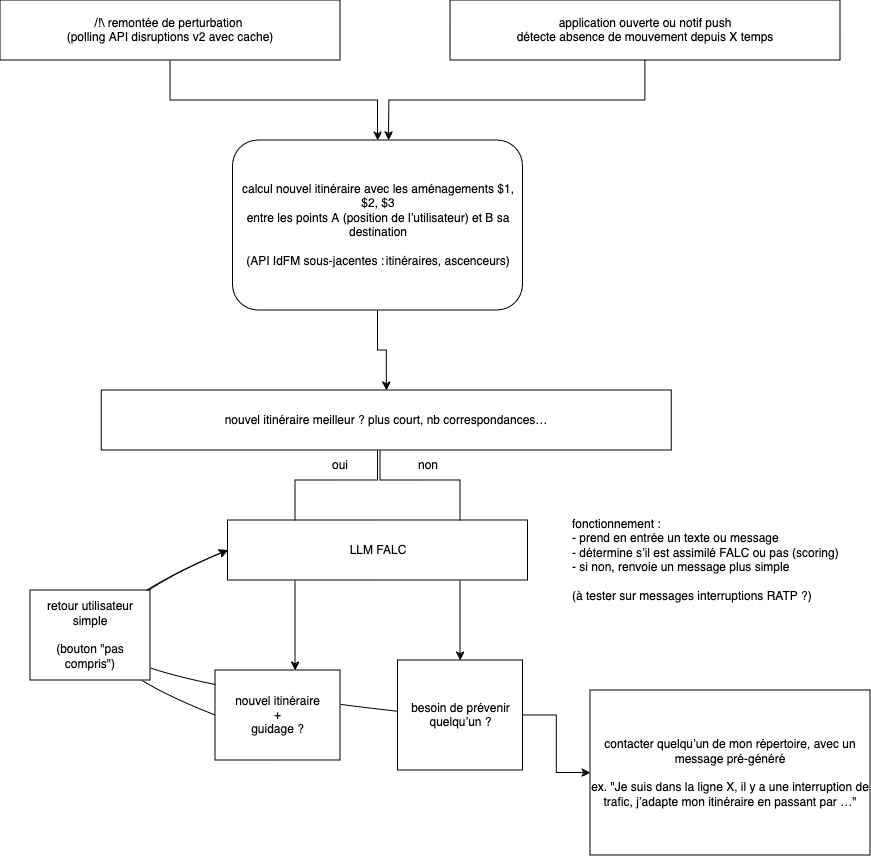
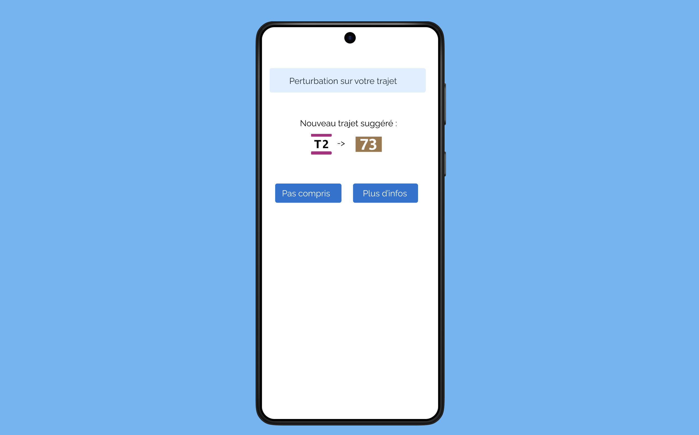
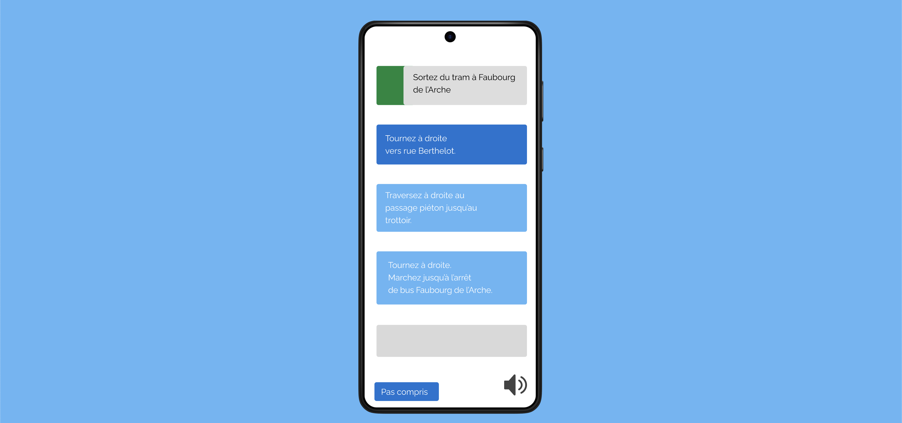

# Accit

## Présentation du projet

Ce projet a été développé dans le cadre du [Hackathon IA et Mobilités](https://www.iledefrance-mobilites.fr/actualites/hackathon-2024-ia-et-mobilites), organisé par Île-de-France Mobilités les 21 et 22 novembre 2024. 
Pour en savoir plus, voici le [Guide des participants et participantes](https://github.com/IleDeFranceMobilites/hackathon_ia_mobilites_2024).


### Le problème et la proposition de valeur 
Nous sommes partis d’un double constat : 
- d’une part, le cas particulier d’une proche du membre du groupe, qui a un trouble cognitif et est sujette au stress lors d’imprévus dans ses trajets routiniers,
- d’autre part, le constat d’une surcharge d’informations dans les transports (annonces contextuelles ou non, panneaux, publicités…) menant à une certaine charge cognitive.

Le problème est de fournir aux utilisateurs, notamment porteurs de troubles cognitifs ou utilisateurs de solutions d’accessibilité, une information simple (mais suffisante) et le moins anxiogène possible.


### La solution
La solution proposée est un prototype d’écrans d’application utilisant une API sous-jacente, elle-même basée sur un modèle LLM de traduction de texte en FALC ; les fonctionnalités développées pourraient à plus long terme être intégrées dans l’application Île-de-France Mobilités, afin de limiter le nombre d’applications à installer pour l’utilisateur (#frugalité). De plus, cela permettrait d’utiliser pour les nouvelles fonctionnalités les informations déjà stockées et connues de l’application IdFM (éléments du profil, trajets favoris) dans un but de minimisation des données collectées (#frugalité et #RGPD).

Le fonctionnement serait le suivant :
- lorsque l’utilisateur est en transit, et qu’une perturbation est détectée sur le trajet (ou impactant son trajet), Accit calcule un nouvel itinéraire en se basant sur
  - la position de l’utilisateur (obtenue par géolocalisation si possible, ou par interpolation sur son parcours si la géolocalisation est impossible, par exemple dans le métro),
  - ses paramètres de trajet (notamment accessibilité physique, vérification pour le nouvel itinéraire que les ascenceurs notamment sont fonctionnels),
  - ses paramètres d’aménagements (à remplir dans le profil : guidage audio, FALC…).
  - ces calculs sont effectués par l’API Accit.
- l’utilisateur est prévenu de l’itinéraire alternatif par une notification push (si l’application est fermée) ou une pop-up (si l’application est active).
- il peut alors suivre cet itinéraire pas à pas, traduit en langage FALC par notre modèle, tout en cochant au fur et à mesure les étapes réalisées pour se rassurer.
- s’il n’y a pas d’itinéraire préférable mais que la perturbation est importante/se prolonge, une option ou un dialogue peut permettre de générer et d’envoyer un message facilement à une personne ressource (du répertoire, ou via la fonction "Partager" du téléphone).
- à tout moment, il peut signaler qu’il n’a pas compris, ce qui permettra d’améliorer le modèle de FALC-isation.



### Éléments techniques
Pour le front, le projet utilise (dans ce dossier de code) [Next.js](https://nextjs.org) initié avec [`create-next-app`](https://nextjs.org/docs/app/api-reference/cli/create-next-app).
Ces éléments front utilisent une API décrite et disponible dans le dossier [accit-api](https://github.com/idfm-ai-hackathon/accit-api).

### Choix de design
L’accessibilité a été prise en compte dans plusieurs aspects du design :
- l’interface est volontairement simple et épurée, elle utilise le système de design d’IdFM pour être familière pour l’utilisateur.
- les couleurs choisies (de la charte graphique IdFM) ne sont volontairement pas les couleurs orange/rouge, qui peuvent être anxiogène.
- la taille de police est fixée à 20 pour être lisible facilement (min 14 recommandé)



Dans le deuxième écran (suivi des étapes du nouveau trajet), les choix suivants ont été faits :
- les étapes successives sont affichées séparément, on met en évidence les deux ou trois étapes suivantes mais pas plus, pour éviter une surcharge d’information,
- on utilise le "bleu Interaction" d’IdFM pour signaler la possibilité d’interagir avec ces étapes
- elles sont "cochables" au fur et à mesure, en "swipant" vers la droite, et apparaissent ensuite avec une bordure verte (couleur de la validation) pour garder un historique du parcours effectué.



### Les problèmes surmontés
> [!TIP]
> Ici vous pouvez présenter les principaux problèmes rencontrés et les solutions apportées

### Et la suite ? 
- Pour l’adaptation des trajets, il pourrait être souhaitable de rajouter dans le profil de l’application IdFM des possibilités d’aménagement qui seraient utilisées dans les fonctionnalités ; à l’heure actuelle, l’accessibilité physique est par exemple prise en compte au niveau de la recherche des trajets, mais pas forcément au niveau de l’utilisateur. La formulation doit être positive et non stigmatisante ; de nombreuses personnes peuvent se sentir mal à l’idée de cocher une case "handicap mental", alors que présenter ces paramètres comme des "aménagements" pourrait conduire à une meilleure adoption.

## Installation et utilisation
> [!TIP]
> Si vous avez le temps, vous pouvez décrire les étapes d'installation de votre projet (commandes à lancer, ...) et son fonctionnement.

### Getting Started

First, run the development server:

```bash
npm run dev
# or
yarn dev
# or
pnpm dev
# or
bun dev
```

Open [http://localhost:3000](http://localhost:3000) with your browser to see the result.

You can start editing the page by modifying `app/page.tsx`. The page auto-updates as you edit the file.

This project uses [`next/font`](https://nextjs.org/docs/app/building-your-application/optimizing/fonts) to automatically optimize and load [Geist](https://vercel.com/font), a new font family for Vercel.

### Deploy on Vercel

The easiest way to deploy your Next.js app is to use the [Vercel Platform](https://vercel.com/new?utm_medium=default-template&filter=next.js&utm_source=create-next-app&utm_campaign=create-next-app-readme) from the creators of Next.js.

Check out our [Next.js deployment documentation](https://nextjs.org/docs/app/building-your-application/deploying) for more details.

## Ressources
Étude sur la charge cognitive à St-Michel - Notre-Dame : https://www.sciencedirect.com/science/article/abs/pii/S0003687020301344 
